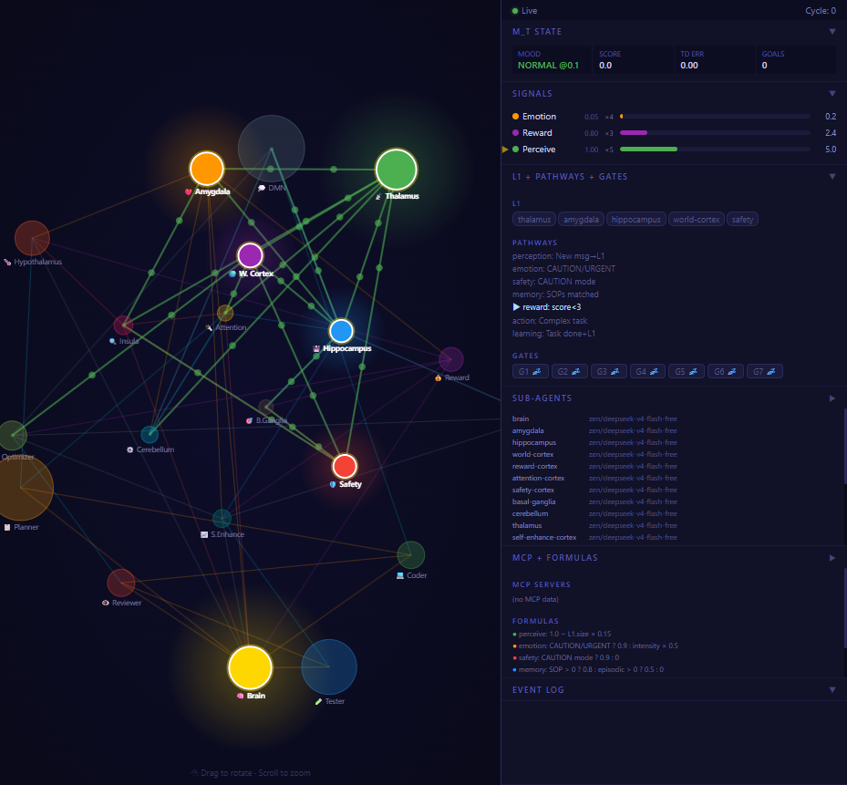

# Brain Agent

OpenCode plugin implementing 7-signal competition architecture from [arXiv 2504.01990](https://arxiv.org/abs/2504.01990).  
20 brain-region agents, 8 MCP servers, G1-G7 safety gates. **149/149 tests passing.**

<div align="center">

[](LICENSE)
[](https://arxiv.org/abs/2504.01990)
[](https://opencode.ai)
[](https://github.com/code-yeongyu/oh-my-opencode)
[]()
[]()

</div>

---

## Install

```bash
git clone https://github.com/joe9939/Brain.git
cd Brain
node install.js
node install.js --status    # verify everything is set up
```

Restart OpenCode. Press Tab → select **[brain]**.

> Requires Node.js 18+, [OpenCode](https://opencode.ai), and [Oh My OpenAgent](https://github.com/code-yeongyu/oh-my-opencode).

---

## Visualizer

Watch brain activity in real-time: [3D Connectome Visualizer](visualizer/)

```
node visualizer/server.mjs
# Open http://localhost:3456
```

Shows 20 brain region agents as an interactive 3D sphere, 7 competing signals with live strength bars, active pathways, G1-G7 gate status, MCP server status, and real-time event log.



## Architecture

7 signals are **always active**. At each tool boundary, the strongest signal injects a `[Brain: ...]` instruction directing the next action.

```
Input → [7 signals compute strength] → strongest wins → inject instruction → LLM acts → M_t updates → signals recompute
```

### Signal Competition

| Signal | Priority | Fires When | Strength Formula |
|--------|----------|------------|------------------|
| perceive | 5 | L1 not complete | 1.0 − n×0.15 |
| emotion | 4 | CAUTION/URGENT mood | 0.9 |
| safety | 4 | CAUTION mode | 0.9 |
| memory | 3 | SOPs or episodic found | 0.8 / 0.5 |
| reward | 3 | score < 3 or td_error > 1 | 0.8 / 0.6 |
| action | 2 | swarm active | 0.8 |
| learning | 1 | goals done + L1 done | 0.7 |

Strength = raw × priority. Winner is deduplicated — only injects when top signal changes.

### Hook Tiers

| Hook | Timing | Role |
|------|--------|------|
| T0 | `experimental.chat.messages.transform` | Inject brain status before LLM |
| T1 | `tool.execute.before` | Safety gates G1-G7 + signal injection |
| T2 | `tool.execute.after` | Update M_t state, recompute signals |
| T3 | `experimental.chat.system.transform` | Detect brain mode from system prompt |
| T4 | `session.event` | Lifecycle (idle, error), BrainTracer |
| P | `permission.ask` | Permission request logging |

---

## Quick Start

### Run a message through the brain

```bash
# All 149 tests
node tests/runner.js --unit --bc --mcp --plugin --tracer --circuits --integration --qc --e2e

# Behavioral (shows full circuit activity)
node tests/runner.js --bc

# Unit tests only
node tests/runner.js --unit
```

### Trace a full session

```bash
node tests/runner.js --bc
```

Output shows every step: message → signal competition → L1 dispatch → state changes → signal switch.

---

## MCP Servers

| Server | Purpose | Tools |
|--------|---------|-------|
| memory-store | Episodic/semantic/procedural memory | store, retrieve, search, decay, consolidate |
| world-model | Codebase dependency graph | query, update, predict, diff |
| reward-system | Reward scoring + value learning | score_action, record_outcome, value_learn |
| tool-tracker | Usage patterns + agent reliability | track, stats, score_agent |
| sop-tracker | Procedure memory | register, match, ppo_score |
| reflexion | Self-refinement loop | start, add_observation, generate_lessons |
| priority-queue | Task scheduling | add, next, complete, prioritize |
| monitor | Health dashboard | get_health, get_alerts, report_event |

---

## Project Structure

```
src/
  plugin/brain-hooks.mjs      Signal competition engine (7 signals, M_t, BrainTracer)
  plugin/brain-plugin.mjs     G1-G7 safety gates + hook wiring
  skills/brain-master.md      Orchestrator prompt (9-line entry)
  mcp/*/                      8 MCP servers
tests/
  runner.js                   149 tests
  unit/                       60 unit tests
  behavioral/                 21 full-session trace tests
  plugin/                     20 plugin hook tests
  mcp/                        8 MCP server tests
  tracer/                     8 BrainTracer tests
  circuits/                   12 circuit tests
  integration/                7 integration tests
  e2e/                        9 end-to-end tests
  qc/                         4 quality control tests
```

---

## Test Status

```
All 149 tests passing on server tokyo (opencode 1.17.13, ubuntu 24.04)

Unit:         60/60  ✅   Plugin:    20/20  ✅   MCP:        8/8  ✅
Behavioral:  21/21  ✅   Tracer:     8/8  ✅   Circuits:  12/12  ✅
Integration:  7/7  ✅   E2E:        9/9  ✅   QC:         4/4  ✅
```

---

## License

[MIT](LICENSE) © 2026 Joe Wong

*Built with reference to "Advances and Challenges in Foundation Agents" (arXiv 2504.01990).*
